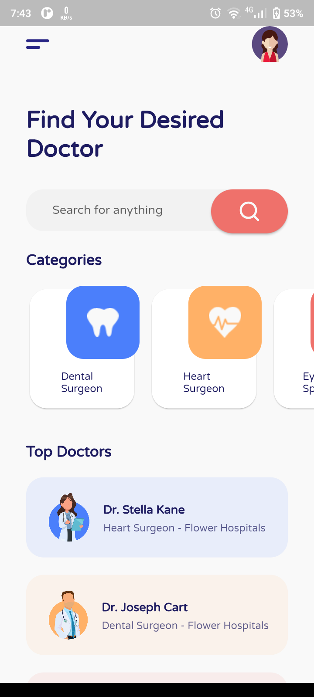
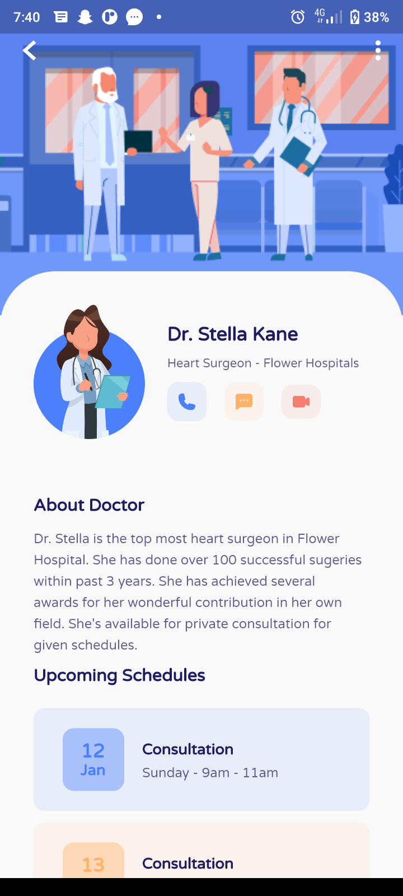
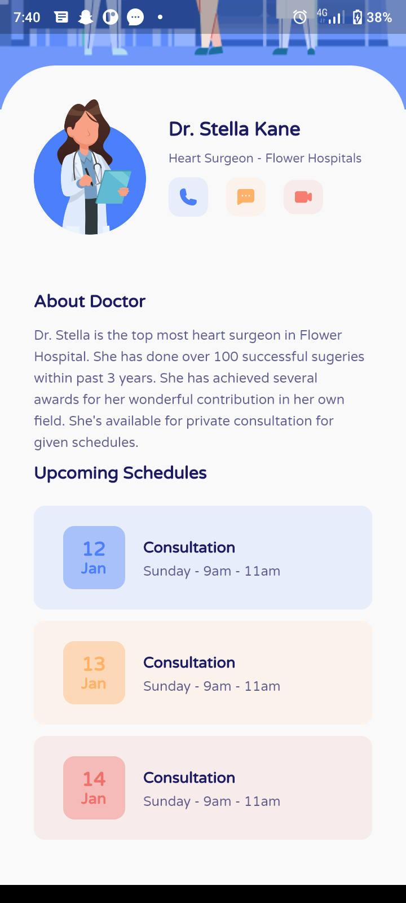
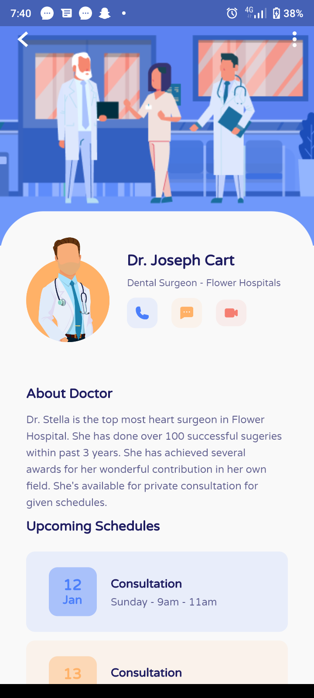
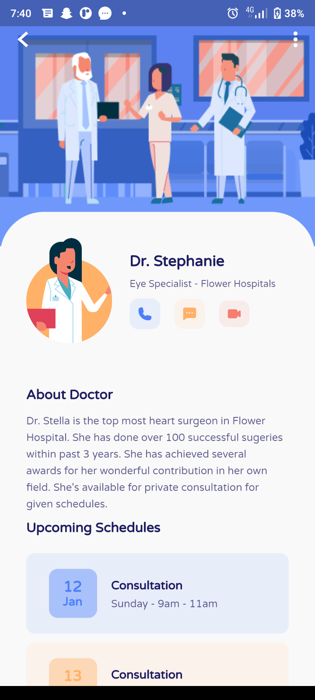

# Doctor Consultation App

A Doctor Consultation App UI Design using Flutter. There are 3 screens: the first screen is onboarding screen, which is the first page that is displayed when the application is run. The second screen is home screen, which contains a search bar, category and top doctors. And then the third screen is detail screen, which displays details about the selected doctor

## Screenshots

